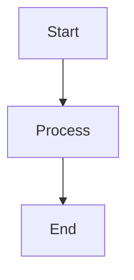

# A-MEM System Diagrams

This directory contains Mermaid diagram definitions for the A-MEM system architecture and workflows.

## 📊 Available Diagrams

### 1. System Architecture Overview
**File**: `system-architecture-overview.mmd`  
**Type**: Graph (Top-Bottom)  
**Description**: High-level system architecture showing all components, their relationships, and data flow.

**Components Covered**:
- Client Layer (Claude Desktop, Claude Code)
- MCP Integration (Protocol, A-MEM Server)
- Core Services (Memory, Embedding, ChromaDB, LiteLLM)
- External APIs (OpenAI, Sentence Transformers)
- Data Storage (ChromaDB, Redis)
- Monitoring (Prometheus, RabbitMQ)

### 2. Memory Storage Flow
**File**: `memory-storage-flow.mmd`  
**Type**: Sequence Diagram  
**Description**: Step-by-step process of storing a memory, from user input to final storage.

**Process Steps**:
1. AI Analysis (GPT-4.1 enhancement)
2. Embedding Generation (384-dimensional vectors)
3. Vector Database Storage (ChromaDB with UUID handling)
4. Link Generation (Similarity-based connections)

### 3. Memory Retrieval Flow
**File**: `memory-retrieval-flow.mmd`  
**Type**: Sequence Diagram  
**Description**: Process of retrieving memories based on similarity search.

**Process Steps**:
1. Query Embedding Generation
2. Vector Similarity Search (L2 distance)
3. Relevance Calculation and Filtering
4. Result Ranking and Response

### 4. Docker Infrastructure
**File**: `docker-infrastructure.mmd`  
**Type**: Graph (Top-Bottom)  
**Description**: Docker container architecture, networking, and volume management.

**Infrastructure Elements**:
- Container orchestration
- Port mappings (internal → external)
- Persistent volumes
- Network isolation
- External service connections

### 5. MCP Integration Architecture
**File**: `mcp-integration-architecture.mmd`  
**Type**: Graph (Top-Bottom)  
**Description**: Model Context Protocol integration with Claude Desktop.

**Integration Components**:
- Claude Desktop Application
- MCP Protocol Layer (JSON-RPC 2.0)
- A-MEM Server Process
- Configuration Management
- Tool Registry and Implementation

### 6. System Status Overview
**File**: `system-status-overview.mmd`  
**Type**: Graph (Top-Bottom)  
**Description**: Current operational status with recent fixes and quality metrics.

**Status Elements**:
- Core Functionality Status
- Integration Layer Health
- Infrastructure Status
- Recent Fixes Applied
- Quality Metrics

## 🎨 Rendering Diagrams

### Online Rendering
You can render these diagrams using:
- [Mermaid Live Editor](https://mermaid.live/)
- [GitHub's built-in Mermaid support](https://github.blog/2022-02-14-include-diagrams-markdown-files-mermaid/)
- [GitLab's Mermaid integration](https://docs.gitlab.com/ee/user/markdown.html#mermaid)

### Local Rendering
Install Mermaid CLI for local rendering:
```bash
npm install -g @mermaid-js/mermaid-cli

# Render to PNG
mmdc -i system-architecture-overview.mmd -o system-architecture-overview.png

# Render to SVG
mmdc -i memory-storage-flow.mmd -o memory-storage-flow.svg
```

### IDE Integration
Many IDEs support Mermaid preview:
- **VS Code**: Mermaid Preview extension
- **IntelliJ/WebStorm**: Mermaid plugin
- **Obsidian**: Built-in Mermaid support

## 📝 Diagram Maintenance

### Update Guidelines
1. **Version Consistency**: Update diagrams when system architecture changes
2. **Accuracy**: Ensure diagrams reflect actual implementation
3. **Clarity**: Maintain clear labeling and logical flow
4. **Styling**: Use consistent color schemes and formatting

### Color Scheme
- **Client Layer**: Light Blue (`#e1f5fe`)
- **MCP/Protocol**: Light Purple (`#f3e5f5`)
- **Core Services**: Light Green (`#e8f5e8`)
- **External APIs**: Light Orange (`#fff3e0`)
- **Data Storage**: Light Pink (`#fce4ec`)
- **Monitoring**: Light Lime (`#f1f8e9`)
- **Operational**: Green (`#c8e6c9`)
- **Fixed Issues**: Orange (`#fff3e0`)
- **Metrics**: Blue (`#e3f2fd`)

### Validation Checklist
- [ ] Syntax is valid Mermaid
- [ ] All components are labeled clearly
- [ ] Relationships are accurate
- [ ] Styling is consistent
- [ ] Diagram renders correctly

## 🔄 Integration with Documentation

These diagrams are referenced in:
- **README.md**: System overview
- **SYSTEM_DOCUMENTATION.md**: Technical reference
- **A-MEM_ARCHITECTURE_v2.md**: Architecture details
- **INSTALLATION_GUIDE.md**: Setup context

## 📊 Diagram Statistics

| Diagram | Type | Nodes | Connections | Complexity |
|---------|------|-------|-------------|------------|
| System Architecture | Graph | 15 | 12 | Medium |
| Memory Storage | Sequence | 8 | 15 | High |
| Memory Retrieval | Sequence | 6 | 12 | Medium |
| Docker Infrastructure | Graph | 12 | 18 | High |
| MCP Integration | Graph | 14 | 16 | Medium |
| System Status | Graph | 17 | 11 | Medium |

## 🎯 Usage Examples

### In Markdown Documents
```markdown

```

### In HTML
```html
<div class="mermaid">
graph TB
    A[Start] --> B[Process]
    B --> C[End]
</div>
```

### As Images
Convert to images for presentations or documentation that doesn't support Mermaid:
```bash
mmdc -i diagram.mmd -o diagram.png -w 1200 -H 800
```

---

## 📚 Additional Resources

- **Mermaid Documentation**: https://mermaid-js.github.io/mermaid/
- **Syntax Guide**: https://mermaid-js.github.io/mermaid/#/flowchart
- **Live Editor**: https://mermaid.live/
- **GitHub Integration**: https://github.blog/2022-02-14-include-diagrams-markdown-files-mermaid/

**Last Updated**: [2025]  
**Version**: 1.0.1  
**Maintainer**: A-MEM Development Team
